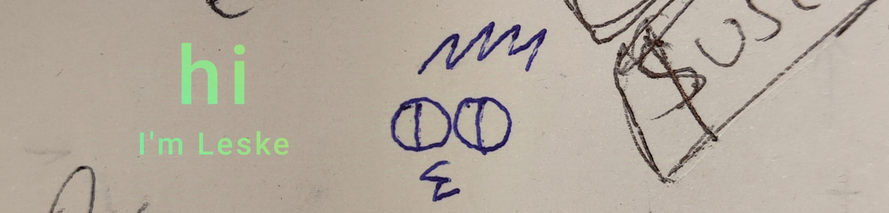

I thoroughly hate promoting myself so I postponed making this ✨ _special_ ✨ readme for as long as I could.

Currently studying (relatively) low level coding at 42 Vienna coding school (I'm in the Common Core).

**Things I'm comfortable with:**

The world is incredibly huge & vast & interesting, and I will never know more than a fraction of it. Anything finite compared to the infinite is nothing. Therefore I usually feel bad about claiming I "know" this or that. Mostly what I have is curiosity.

### Check out some of my projects:

- Currently building an HTTP 1.1 [webserver](https://github.com/LeaYeh/webserver) with a team from school
- I made a [guide](https://github.com/leske42/CPP09) for implementing the Ford-Johnson merge insertion sort
- We built a [shell](https://github.com/sumon-ohid/42-minishell) with [Sumon](https://github.com/sumon-ohid)
- Tiny [exercises](https://github.com/leske42/Rust-Piscine) I did in Rust
- My [solutions](https://github.com/leske42/Advent-of-Code) to Advent of Code in C and C++

### Things that interest me:

**How a computer operates.** In 42 we mostly work with C, and C is abstracting away a lot of details of what is going to happen upon execution. Disassembling an executable feels like a huge deal at first, but you quickly realize that while you got rid of *some* of the abstraction, it will still not tell you much of what's actually going on (especially on a Complex Instruction Set architecture). But looking into this feels like meeting the sublime. A very beautiful but very overwhelming topic.

**How a language is built.** Because C is a compiled language, in this case this basically means how the compiler operates. How it parses and translates what I write, what happens when the assembler takes over, and then that very fine line of transition between software and hardware. I never felt like I can claim I know C if I don't know what happens to the code when I'm done.

**Compiler optimizations.** Because the compiler is usually not just "translating" your code. On O0, I can more or less recognize my C in the Assembly, but from O1 onwards I have no chance. I feel like I can learn a lot from this process.

<!--
I will leave this template here cause maybe i will need it

## Hi there 👋

**leske42/leske42** is a ✨ _special_ ✨ repository because its `README.md` (this file) appears on your GitHub profile.

Here are some ideas to get you started:

- 🔭 I’m currently working on ...
- 🌱 I’m currently learning ...
- 👯 I’m looking to collaborate on ...
- 🤔 I’m looking for help with ...
- 💬 Ask me about ...
- 📫 How to reach me: ...
- 😄 Pronouns: ...
- ⚡ Fun fact: ...
-->
